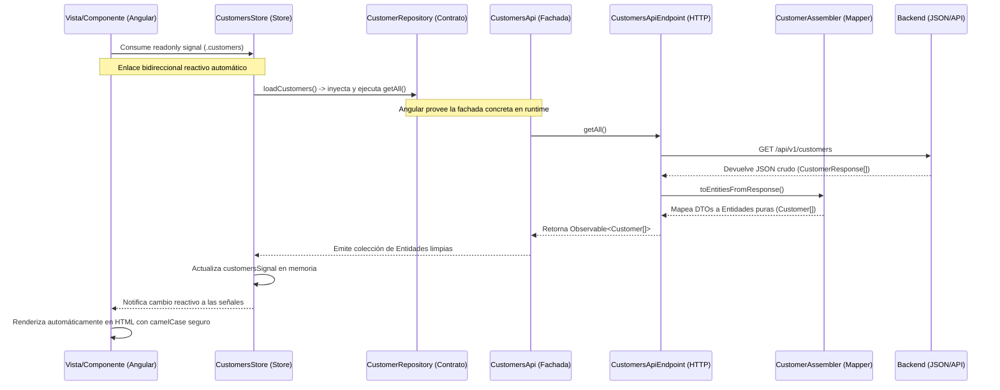

# Guía de Arquitectura, Diseño y Organización de Código

Este documento establece las directrices de arquitectura y diseño de software para el frontend de la plataforma **Atelier**. El objetivo principal es garantizar que todo el equipo de desarrollo comparta la misma visión, manteniendo un código modular, mantenible, escalable y altamente tipado.

---

## 1. Filosofía Arquitectónica: DDD + Clean Architecture

Para evitar el desorden y el acoplamiento a medida que el proyecto crece, adoptamos **Domain-Driven Design (DDD)** y **Clean Architecture** aplicados al desarrollo frontend.

### Regla de Oro de las Capas
El flujo de dependencias siempre va **hacia el interior**:
* El **Dominio** no conoce nada sobre la infraestructura (APIs, HTTP) ni sobre la presentación (Angular, componentes, HTML).
* La **Infraestructura** conoce el dominio para poder implementar sus contratos.
* la **Presentación** consume la capa de dominio a través de inyección de dependencias (DI).

---

## 2. Organización del Código: Bounded Contexts

Cada módulo comercial del sistema se organiza como un **Bounded Context** (Contexto Acotado) independiente directamente en el nivel raíz de `src/app/`.

> [!IMPORTANT]
> Queda estrictamente prohibido el uso de carpetas contenedoras genéricas (como `features/` o `modules/`). Los contextos deben ser vecinos directos (ej. `customers/`, `appointments/`, `shared/`).

### Estructura Interna de un Bounded Context
Cada contexto acotado se organiza internamente en tres capas bien definidas:

```text
📁 src/app/[context-name]/
   ├── 📁 domain/          <-- Capa de Dominio (Reglas de negocio puras)
   │   ├── 📁 models/      <-- Entidades y objetos de valor con comportamiento
   │   └── 📁 repositories/ <-- Interfaces/contratos de persistencia
   │
   ├── 📁 application/     <-- Capa de Aplicación (Gestión de estado y orquestación)
   │   └── 📄 *.store.ts    <-- Almacén de estado reactivo (Angular Signals Store)
   │
   ├── 📁 infrastructure/  <-- Capa de Infraestructura (Llamadas HTTP, adaptadores)
   │   ├── 📄 *-response.ts  <-- DTOs/Contratos de red de la API (espejo del JSON)
   │   ├── 📄 *-assembler.ts <-- Mapeadores/Anti-Corruption Layer (DTO -> Entidad)
   │   ├── 📄 *-api-endpoint.ts <-- Clientes HTTP individuales por agregado
   │   └── 📄 *-api.ts       <-- Fachada principal de red del contexto (Facade)
   │
   └── 📁 presentation/    <-- Capa de Presentación (Interfaz de usuario)
       ├── 📁 components/  <-- Componentes visuales reutilizables e internos
       ├── 📁 views/       <-- Páginas principales y controladores de vistas
       └── 📄 *.routes.ts  <-- Enrutamiento dinámico del contexto
```

---

## 3. Desglose Detallado por Capas

### A. Capa de Dominio (`domain/`)
Es el corazón del software. Debe estar escrita en TypeScript puro, sin decorators de Angular u otras librerías externas.

* **La Subcarpeta `models` (o `model` / Entidades):** Define qué es el objeto de negocio y cómo se comporta (sus datos, validaciones y reglas lógicas). *Ejemplo:* `Customer` es un cliente que tiene un nombre, un teléfono y calcula su propia inicial del avatar. Es un concepto puro de datos y comportamiento.
* **La Subcarpeta `repositories` (Contratos/Interfaces):** Define cómo se accede o se guarda ese objeto en el mundo exterior, pero de forma abstracta (sin importar si es una base de datos SQL, NoSQL o llamadas HTTP). *Ejemplo:* `CustomerRepository` es un contrato que promete que podemos guardar o buscar clientes.

---

### B. Capa de Aplicación (`application/`)
Representa los casos de uso y la gestión de estado de la aplicación. Es la capa de coordinación central.

* **La Subcarpeta `application/` (Stores/Servicios de Aplicación):** Orquesta los casos de uso del negocio y administra el estado reactivo en memoria utilizando Angular Signals.
  * *Ejemplo:* El archivo `customers.store.ts` maneja la lista de clientes cargados, el estado de carga (`loading`), el estado de guardado (`saving`) y los errores, coordinando las llamadas HTTP con la Fachada de red de Infraestructura.

---

### C. Capa de Infraestructura (`infrastructure/`)
Contiene las implementaciones técnicas de los contratos de dominio y la comunicación de red.

#### El Patrón Fachada de Red (`*-api.ts`)
Para simplificar el uso del contexto desde el exterior, cada módulo expone un único servicio público Fachada de nivel de contexto (ej. `CustomersApi`) que hereda de `BaseApi`:
* **Punto de Entrada Único:** Todo el resto del sistema interactúa únicamente con la Fachada para temas de red.
* **Orquestación:** La fachada inyecta internamente los endpoints específicos (`CustomersApiEndpoint`) y delega las operaciones hacia ellos de forma transparente.
* **Extensibilidad:** Si el contexto añade nuevos agregados, la Fachada los integra sin romper el código del resto del frontend.

#### Mapeadores / Capa Anti-Corrupción (`*-assembler.ts`)
Las respuestas JSON de la base de datos o APIs suelen usar formatos de red específicos (ej. `snake_case`, IDs en texto, etc.).
* El **Assembler** traduce el DTO de red (`CustomerResponse`) a la Entidad de dominio pura (`Customer`) en `camelCase`.
* Esto protege tu frontend: si el backend cambia el nombre de un campo de base de datos, solo tocas el Assembler y el DTO, protegiendo tus componentes visuales de errores colaterales.

---

### D. Capa de Presentación (`presentation/`)
Es la capa gráfica e interactiva en Angular.

* **`views/` (Vistas/Páginas/Formularios):** Representa las páginas principales accesibles directamente por enrutamiento (ej. `customers-list/`) así como los sub-escenarios, formularios complejos o sub-vistas del contexto (ej. `customer-form/`). 
  > [!NOTE]
  > Para asegurar simetría y legibilidad, tanto los listados principales como sus formularios se alojan bajo `views/` de forma independiente (ej. `course-list/` y `course-form/`). Esto mantiene un estándar homogéneo en todos los módulos de la aplicación.
* **`components/` (Componentes):** Bloques de construcción visuales reutilizables y atómicos internos del contexto que no representan flujos o páginas por sí mismos (ej. botones especiales, tarjetas de un item, alertas customizadas).
* **Desacoplamiento Estricto:** Los componentes de presentación **nunca** deben importar directamente clases de la capa de infraestructura (como Endpoints o Assemblers). En su lugar, inyectan el contrato abstracto del dominio (`CustomerRepository`) que Angular proveerá automáticamente en runtime.

#### Patrón de Enrutamiento Modular Diferido (Lazy Loading Delegado)
Para maximizar la eficiencia en la carga inicial y el aislamiento del código, el enrutador global de la aplicación (`app.routes.ts`) **nunca** carga directamente componentes de presentación individuales. En su lugar:
1. El enrutador de nivel raíz delega la resolución de rutas al Bounded Context mediante `loadChildren()`:
   ```typescript
   // app.routes.ts
   {
     path: 'customers',
     loadChildren: () => import('./customers/presentation/customers.routes').then(m => m.customersRoutes)
   }
   ```
2. Cada contexto define autónomamente su árbol de navegación interno (`*.routes.ts`), cargando de forma perezosa (`loadComponent`) únicamente los componentes controladores necesarios:
   ```typescript
   // customers.routes.ts
   const customersList = () => import('./views/customers-list/customers-list').then(m => m.CustomersList);

   export const customersRoutes: Routes = [
     { path: '', loadComponent: customersList }
   ];
   ```

#### Patrón de Integración Desacoplada vía Variables de Plantilla (`#form`)
Cuando una vista principal (como `customers-list`) utiliza un modal para realizar flujos transaccionales (como registrar un cliente), adoptamos un patrón de delegación visual basado en variables de plantilla Angular:
* **Responsabilidad de Negocio Encapsulada:** El formulario (ej. `<app-customer-form>`) mantiene el 100% de sus validaciones, estados de carga y envío de datos en su propia clase controladora de forma auto-contenida.
* **Orquestación Visual Desacoplada:** La vista contenedora utiliza una variable de plantilla (`#form`) en su HTML para consultar reactivamente las propiedades del formulario e integrarlas en los contenedores compartidos (como barras inferiores de botones o títulos del modal) sin que el componente padre necesite declarar variables del formulario o conocer su lógica de validación interna.

```html
<!-- customers-list.html (Componente Contenedor) -->
<app-modal [isOpen]="isModalOpen()">
  <!-- Acceso directo al estado interno del formulario hijo para pintar títulos dinámicos -->
  <h2 modal-title>
    @if (form.modalStep() === 'SEARCH') { {{ 'customers.title.search' | translate }} }
  </h2>

  <!-- Instanciación limpia del formulario hijo -->
  <app-customer-form modal-body #form (saved)="onCustomerSaved()"></app-customer-form>

  <!-- Control de habilitación de botones y spinners directamente de las señales de #form -->
  <div modal-actions>
    <button (click)="form.onSubmit()" [disabled]="form.customerForm.invalid || form.isSaving()">
      <span *ngIf="form.isSaving()" class="spinner"></span>
      Guardar
    </button>
  </div>
</app-modal>
```

---

## 4. Reglas Estrictas de Estilo y Programación

### I. Tipado Estricto de Datos
* Está **estrictamente prohibido el uso de `any`** en cualquier parte de la comunicación de red o el mapeo.
* Cada payload devuelto por un servicio HTTP debe estar modelado de forma estricta mediante una interfaz de respuesta en su correspondiente archivo `*-response.ts` (ej. `CustomerResponse`).

### II. Estilo de Comentarios en TypeScript
Para mantener un estándar limpio y profesional, se define una única regla de comentarios:

* **Solo se permiten comentarios de tipo TSDoc:**
  ```typescript
  /**
   * Descripción clara de la clase, método o interfaz.
   * 
   * @param paramName - Detalle del parámetro.
   * @returns Explicación del retorno.
   */
  ```
* **Prohibido:** El uso de comentarios de línea genéricos (`//`) o bloques visuales decorativos extensos en los archivos TypeScript.

### III. Internacionalización (i18n) en Vistas Standalone

Para asegurar que la plataforma pueda ser consumida en múltiples idiomas de forma ágil (español e inglés por defecto), se establece el uso mandatorio del servicio de traducción reactiva `ngx-translate`.

* **Prohibido textos hardcoded:** Todas las cadenas de texto legibles por el usuario en las plantillas HTML o mensajes dinámicos en archivos TS deben usar llaves de traducción estructuradas, cargadas desde archivos JSON independientes ubicados en [es.json](file:///home/aldodev/OpenSource/atelier-webapp-open-source/public/i18n/es.json) y [en.json](file:///home/aldodev/OpenSource/atelier-webapp-open-source/public/i18n/en.json).
* **Registrar en componentes standalone:** Para habilitar la directiva o el pipe de traducción en cualquier vista o componente autónomo, se debe importar de forma explícita el módulo de traducción:
  ```typescript
  import { TranslateModule } from '@ngx-translate/core';

  @Component({
    // ...
    imports: [TranslateModule, CommonModule]
  })
  ```
* **Uso del pipe de traducción en plantillas HTML:**
  * *Texto estático:* `<h1>{{ 'customers.title' | translate }}</h1>`
  * *Texto dinámico con variables:* `<span>{{ 'customers.services-performed' | translate: { count: customer.servicesCount } }}</span>`

### IV. Enrutamiento Moderno de Angular (Signals Link Binding)

Con el fin de evitar inyectar de manera repetitiva el servicio `ActivatedRoute` dentro de los componentes controladores para leer parámetros de URL o de consulta (Query Params), adoptamos el estándar reactivo más moderno de Angular.

* **Habilitación de Component Input Binding:** Se debe configurar siempre el enrutador principal en [app.config.ts](file:///home/aldodev/OpenSource/atelier-webapp-open-source/src/app/app.config.ts) utilizando la bandera `withComponentInputBinding()`:
  ```typescript
  provideRouter(routes, withComponentInputBinding())
  ```
* **Lectura de parámetros de URL vía Signal Inputs (`input()`):** Los componentes visuales que carguen mediante enrutamiento dinámico leen de forma reactiva y síncrona los parámetros del path o query params usando la función `input()` nativa de Angular:
  ```typescript
  import { Component, input } from '@angular/core';

  @Component({ ... })
  export class DetailComponent {
    // Parámetro de ruta 'id' (ej. /detail/:id) mapeado automáticamente como un Signal de solo lectura
    id = input.required<string>();
  }
  ```

---

## 5. Ejemplo de Flujo de Datos Completo (DDD)

Para cargar el listado de clientes en pantalla, el flujo de ejecución transcurre de forma totalmente reactiva y secuencial a través de las capas de la arquitectura:



---

## 6. Guía Paso a Paso: Cómo Crear un Nuevo Bounded Context desde Cero

Para añadir un nuevo contexto comercial (por ejemplo, `vehicles`), se deben heredar las abstracciones base ubicadas en `src/app/shared/`. Esto garantiza que heredes de forma automática la traducción de errores, el enrutamiento HTTP genérico y el ciclo de vida reactivo de la aplicación.

Sigue estos 7 pasos estructurados:

### Paso 1: Crear la Entidad de Dominio (`domain/models/`)
Toda entidad comercial debe extender de `BaseEntity` (ubicada en [base-entity.ts](file:///home/aldodev/OpenSource/atelier-webapp-open-source/src/app/shared/domain/model/base-entity.ts)).

Crea `src/app/vehicles/domain/models/vehicle.entity.ts`:
```typescript
import { BaseEntity } from '../../../shared/domain/model/base-entity';

export class Vehicle extends BaseEntity {
  constructor(
    id: string,
    public readonly brand: string,
    public readonly model: string,
    public readonly plateNumber: string
  ) {
    super(id);
  }
}
```

### Paso 2: Definir el Contrato del Repositorio (`domain/repositories/`)
Crea la interfaz abstracta pura que servirá de desacoplamiento con la persistencia.

Crea `src/app/vehicles/domain/repositories/vehicle.repository.ts`:
```typescript
import { Observable } from 'rxjs';
import { Vehicle } from '../models/vehicle.entity';

export abstract class VehicleRepository {
  abstract getAll(): Observable<Vehicle[]>;
  abstract create(vehicle: Vehicle): Observable<Vehicle>;
}
```

### Paso 3: Crear los Contratos de Red de Infraestructura (`infrastructure/`)
Define la estructura exacta del JSON retornado por la API extendiendo de `BaseResource` y `BaseResponse` (ubicados en [base-response.ts](file:///home/aldodev/OpenSource/atelier-webapp-open-source/src/app/shared/infrastructure/base-response.ts)).

Crea `src/app/vehicles/infrastructure/vehicles-response.ts`:
```typescript
import { BaseResource, BaseResponse } from '../../shared/infrastructure/base-response';

export interface VehicleResponse extends BaseResource {
  id: string;
  brand: string;
  model: string;
  plate_number: string; // Notar el formato snake_case del JSON de la API
}

export interface VehiclesListResponse extends BaseResponse {
  vehicles: VehicleResponse[];
}
```

### Paso 4: Implementar el Traductor / Mapper (`infrastructure/`)
Implementa un ensamblador heredando de `BaseAssembler` (ubicado en [base-assembler.ts](file:///home/aldodev/OpenSource/atelier-webapp-open-source/src/app/shared/infrastructure/base-assembler.ts)) para traducir entre tu Entidad limpia y los objetos de transferencia de red (Anti-Corruption Layer).

Crea `src/app/vehicles/infrastructure/vehicle-assembler.ts`:
```typescript
import { Injectable } from '@angular/core';
import { BaseAssembler } from '../../shared/infrastructure/base-assembler';
import { Vehicle } from '../domain/models/vehicle.entity';
import { VehicleResponse, VehiclesListResponse } from './vehicles-response';

@Injectable({ providedIn: 'root' })
export class VehicleAssembler implements BaseAssembler<Vehicle, VehicleResponse, VehiclesListResponse> {
  toEntityFromResource(resource: VehicleResponse): Vehicle {
    return new Vehicle(
      resource.id,
      resource.brand,
      resource.model,
      resource.plate_number // Traduce de snake_case a camelCase de forma segura
    );
  }

  toEntitiesFromResponse(response: VehiclesListResponse): Vehicle[] {
    return response.vehicles.map(v => this.toEntityFromResource(v));
  }

  toResourceFromEntity(entity: Vehicle): VehicleResponse {
    return {
      id: entity.id,
      brand: entity.brand,
      model: entity.model,
      plate_number: entity.plateNumber // Traduce de vuelta a snake_case para enviar al servidor
    };
  }
}
```

### Paso 5: Implementar el Endpoint API y la Fachada (`infrastructure/`)
Hereda de `BaseApiEndpoint` (ubicado en [base-api-endpoint.ts](file:///home/aldodev/OpenSource/atelier-webapp-open-source/src/app/shared/infrastructure/base-api-endpoint.ts)) para dotar a tu cliente HTTP de operaciones REST genéricas preconfiguradas, y de `BaseApi` para la Fachada del contexto.

Crea `src/app/vehicles/infrastructure/vehicles-api-endpoint.ts`:
```typescript
import { Injectable, inject } from '@angular/core';
import { HttpClient } from '@angular/common/http';
import { BaseApiEndpoint } from '../../shared/infrastructure/base-api-endpoint';
import { Vehicle } from '../domain/models/vehicle.entity';
import { VehicleResponse, VehiclesListResponse } from './vehicles-response';
import { VehicleAssembler } from './vehicle-assembler';
import { environment } from '../../../environments/environment';

@Injectable({ providedIn: 'root' })
export class VehiclesApiEndpoint extends BaseApiEndpoint<Vehicle, VehicleResponse, VehiclesListResponse, VehicleAssembler> {
  constructor() {
    const http = inject(HttpClient);
    const assembler = inject(VehicleAssembler);
    const vehiclesUrl = `${environment.platformProviderApiBaseUrl}/vehicles`;
    super(http, vehiclesUrl, assembler);
  }
}
```

Crea `src/app/vehicles/infrastructure/vehicles-api.ts` (Fachada de Infraestructura):
```typescript
import { Injectable, inject } from '@angular/core';
import { Observable } from 'rxjs';
import { BaseApi } from '../../shared/infrastructure/base-api';
import { VehicleRepository } from '../domain/repositories/vehicle.repository';
import { VehiclesApiEndpoint } from './vehicles-api-endpoint';
import { Vehicle } from '../domain/models/vehicle.entity';

@Injectable({ providedIn: 'root' })
export class VehiclesApi extends BaseApi implements VehicleRepository {
  private readonly vehiclesEndpoint = inject(VehiclesApiEndpoint);

  getAll(): Observable<Vehicle[]> {
    return this.vehiclesEndpoint.getAll();
  }

  create(vehicle: Vehicle): Observable<Vehicle> {
    return this.vehiclesEndpoint.create(vehicle);
  }
}
```

### Paso 6: Crear el Almacén de Estado de la Aplicación (`application/`)
Crea `src/app/vehicles/application/vehicles.store.ts` para centralizar el estado y proveer selectores e interfaces de Signals de sólo lectura:

```typescript
import { Injectable, signal, inject, computed } from '@angular/core';
import { VehicleRepository } from '../domain/repositories/vehicle.repository';
import { Vehicle } from '../domain/models/vehicle.entity';

@Injectable({ providedIn: 'root' })
export class VehiclesStore {
  private readonly repository = inject(VehicleRepository);
  private readonly vehiclesSignal = signal<Vehicle[]>([]);
  private readonly loadingSignal = signal<boolean>(false);

  readonly vehicles = this.vehiclesSignal.asReadonly();
  readonly loading = this.loadingSignal.asReadonly();

  loadVehicles(): void {
    this.loadingSignal.set(true);
    this.repository.getAll().subscribe({
      next: (data) => {
        this.vehiclesSignal.set(data);
        this.loadingSignal.set(false);
      },
      error: () => this.loadingSignal.set(false)
    });
  }
}
```

### Paso 7: Vincular en el Inyector Global (`app.config.ts`)
Para que Angular inyecte automáticamente la fachada concreta cada vez que se solicite la interfaz de dominio (Repository), regístrala en los proveedores globales de [app.config.ts](file:///home/aldodev/OpenSource/atelier-webapp-open-source/src/app/app.config.ts):

```typescript
import { VehicleRepository } from './vehicles/domain/repositories/vehicle.repository';
import { VehiclesApi } from './vehicles/infrastructure/vehicles-api';

export const appConfig: ApplicationConfig = {
  providers: [
    // ... otros proveedores
    { provide: VehicleRepository, useClass: VehiclesApi }
  ]
};
```

